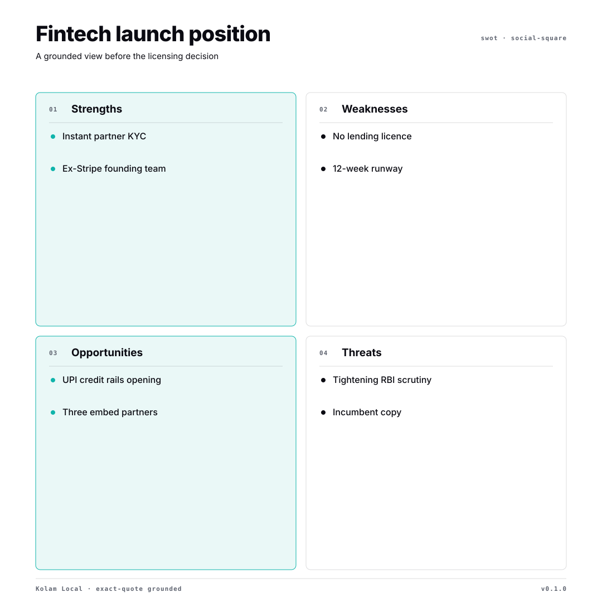
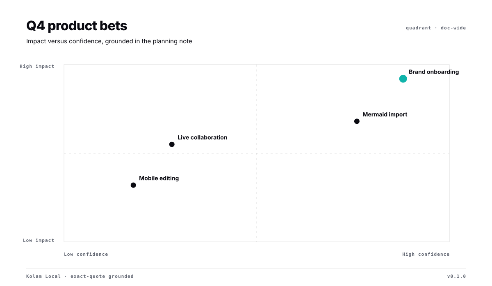
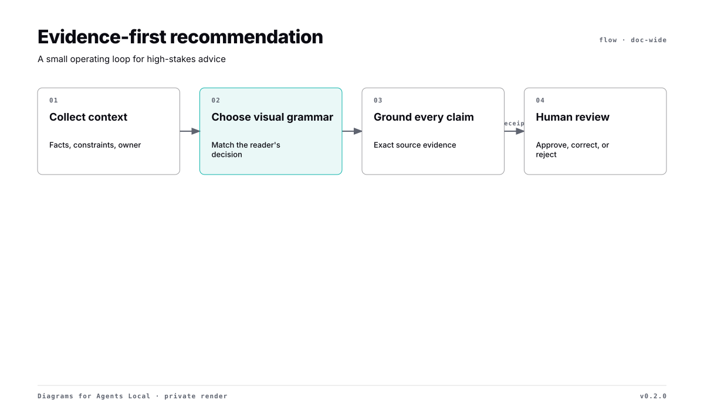
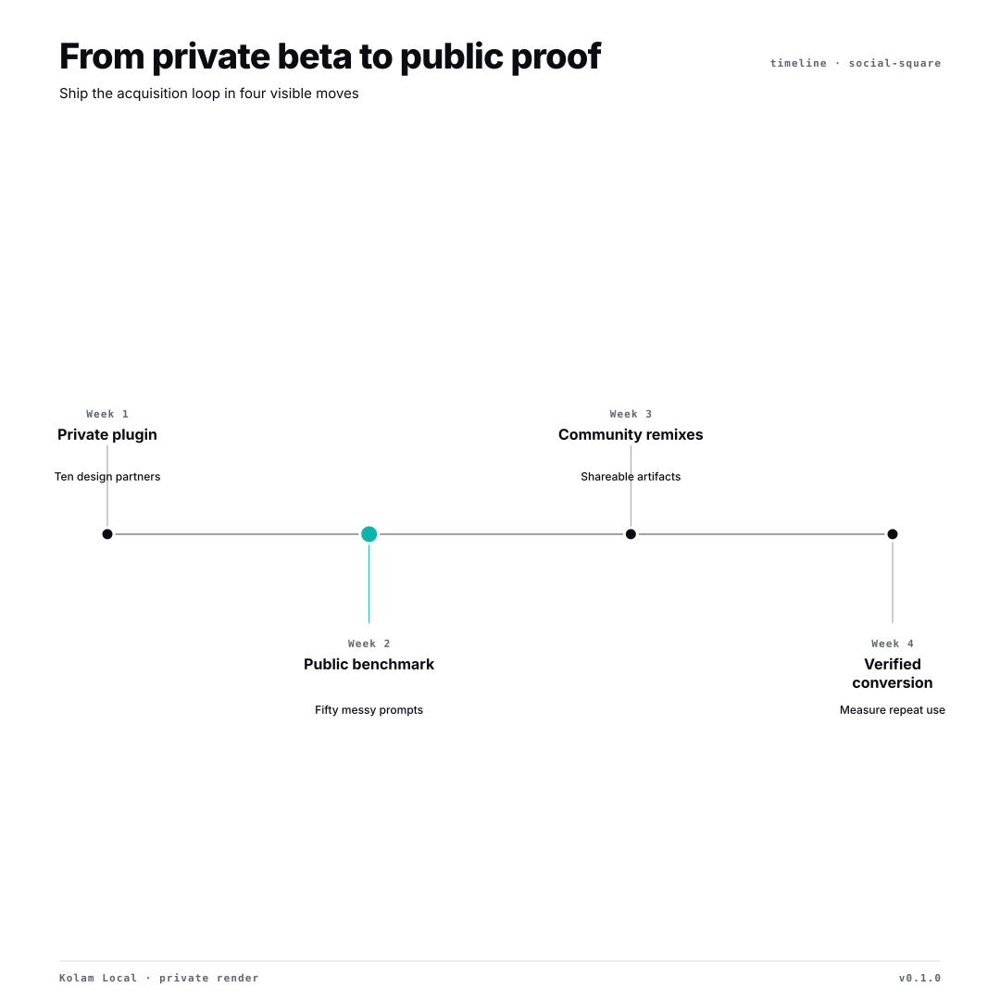
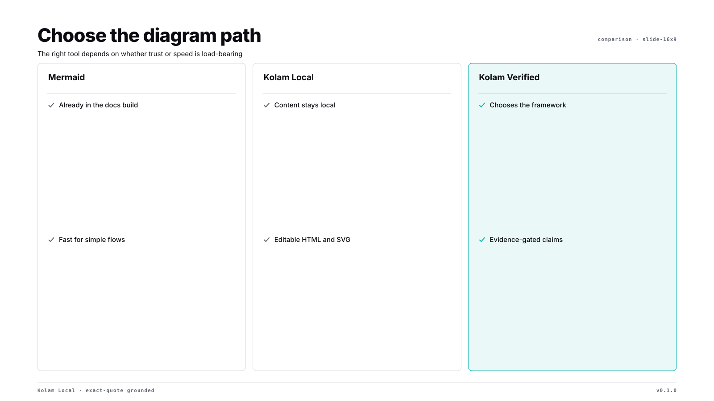
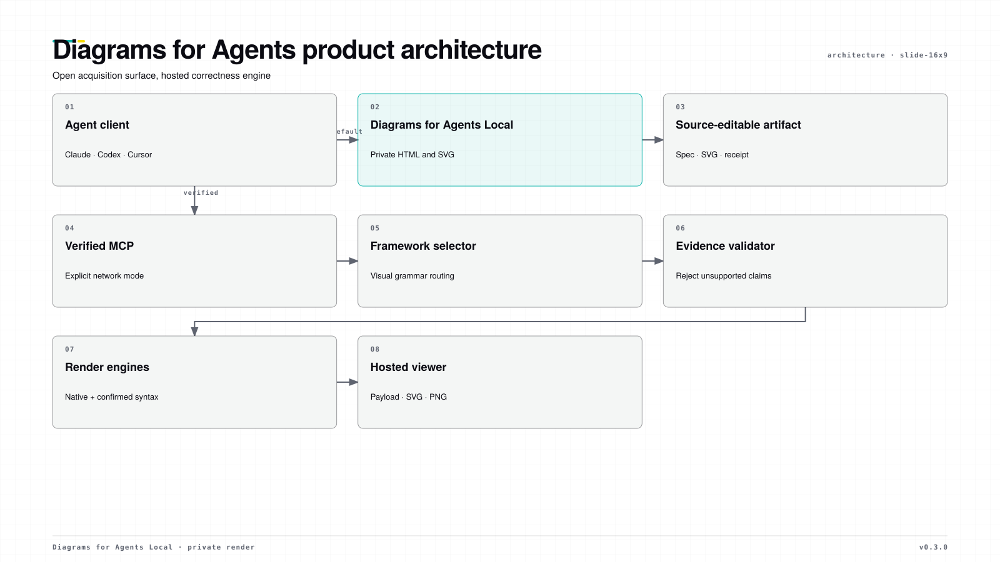

# Diagrams for Agents

**Agents can write. Agents can code. Now give them visual judgment.**

LLMs know how to draw boxes and arrows. They do not reliably know when the information should become a matrix, journey map, capability map, RACI, timeline, causal model, architecture diagram, or something else entirely.

Diagrams for Agents turns messy business, product, and technical context into the visual that best explains it. The open skill works privately on your machine and creates branded, source-editable artifacts. Verified MCP is an explicit opt-in when you need broader automatic visual selection, stronger evidence validation, or a stable API result.


## The difference is visual judgment

```text
Messy context
    ↓
What is the reader trying to understand or decide?
    ↓
Which visual form best expresses that?
    ↓
What belongs in its canonical structure?
    ↓
Is every important claim supported?
    ↓
Apply the approved brand profile and render
```

Ask with no diagram type:

> AWS cost increased 37%. RDS caused 48% of the increase, idle EKS nodes 31%, NAT traffic 14%, and other costs 7%. Engineering can address EKS now; the database team owns RDS.

A generic diagram tool draws a cloud-cost flowchart. Diagrams for Agents identifies an attribution-and-action problem: the useful visual ranks the drivers, shows contribution, names ownership, and makes the next intervention obvious.

## Example gallery

Each example is an editable SVG generated from a reviewable JSON source. Together they show the decision types Local Mode can handle without sending your context anywhere.

| Grounded strategy | Decision positioning |
|---|---|
|  |  |
| Operating flow | Change over time |
|  |  |
| Comparing diagram paths | Product architecture |
|  |  |

The source JSON, standalone SVG, and self-contained HTML are all in [`examples/`](examples/), so each diagram can be inspected or adapted rather than treated as a static mockup.

## What makes it different

- **No invented SWOTs.** Business claims carry exact quotes from the supplied source; missing or altered evidence fails the render.
- **Private by default.** Local Mode has no account and makes no network call unless anonymous telemetry is explicitly enabled.
- **Decision first.** Diagrams for Agents selects a visual around what the reader needs to understand, with strict complexity budgets.
- **Your visual system, not ours.** A portable brand profile carries approved colors, type, density, corner treatment, and concise brand guidance into every local artifact.
- **Artifacts you own.** Every output is a self-contained HTML file with inline SVG, an embedded JSON specification, and an optional receipt.
- **A real escalation path.** Verified Mode connects the same workflow to the product's broader framework catalogue and hosted correctness engine.

## Install

The package uses the shared Agent Skills layout and includes native Codex and Claude plugin manifests.

### Codex

```text
codex plugin marketplace add ankaiinc/diagrams-for-agents
codex plugin add diagrams-for-agents@diagrams-for-agents
```

### Claude Code

```text
/plugin marketplace add ankaiinc/diagrams-for-agents
/plugin install diagrams-for-agents@diagrams-for-agents
```

### Pi

```bash
pi install https://github.com/ankaiinc/diagrams-for-agents
```

### Cursor

```text
/add-plugin https://github.com/ankaiinc/diagrams-for-agents
```

Cursor reads `.cursor-plugin/plugin.json`, loads the shared skill, and configures the Verified MCP from `mcp.json`.

### Other Agent Skills clients

Copy or link `skills/diagrams-for-agents` into the client's skills directory. The skill itself has no package dependencies; the renderer requires Node 18 or newer.

## Try it

Ask your agent without naming a format:

> Turn these product notes into the one diagram that will help us choose what to build next. Keep it private.

Or render the bundled grounded SWOT directly:

```bash
node skills/diagrams-for-agents/scripts/render.mjs \
  examples/fintech-swot.diagrams-for-agents.json \
  fintech-swot.html \
  --svg fintech-swot.svg \
  --receipt fintech-swot.receipt.json
```

The seventeen Local Mode families are:

| Family | Best for |
|---|---|
| SWOT | Internal/external advantages and risks |
| Quadrant | Positioning on two decision-relevant axes |
| Comparison | Tradeoffs between alternatives |
| Flow | Work and decision logic |
| Timeline | Milestones and change over time |
| Architecture | Components, boundaries, and dependencies |
| Cycle | Reinforcing loops, flywheels, and repeatable systems |
| Pyramid | Hierarchies, maturity, and foundation-to-outcome stories |
| Stack | Layers that build on one another |
| Venn | Overlap between two or three sets |
| Swimlane | Handoffs across people, teams, or systems |
| RACI | Responsibility and accountability |
| SIPOC | Supplier-to-customer process boundaries |
| Fishbone | Cause categories behind an effect |
| Journey map | Actions, pain, and opportunities across stages |
| Capability map | Business capabilities by domain and level |
| Strategy map | Enablers and outcomes across perspectives |

Browse the generated files in [`examples/`](examples/). Each example is built from a reviewable `.diagrams-for-agents.json` source.

## Bring your design system

Save an approved profile at `.diagrams-for-agents/brand.json` and reuse it across artifacts:

```json
{
  "name": "Northstar",
  "guidance": "Calm, evidence-first operating artifacts. Use yellow only for decisions needing attention.",
  "theme": {
    "paper": "#fbfaf7",
    "surface": "#f0f2ed",
    "ink": "#17201c",
    "muted": "#61706a",
    "accent": "#0d8f79",
    "accent2": "#f0c94b",
    "font": "Avenir Next, Helvetica Neue, sans-serif",
    "displayFont": "Avenir Next, Helvetica Neue, sans-serif"
  },
  "style": { "tone": "editorial", "density": "relaxed", "corner": "soft" }
}
```

```bash
node skills/diagrams-for-agents/scripts/render.mjs input.json output.html \
  --brand .diagrams-for-agents/brand.json \
  --svg output.svg
```

The profile is local JSON, contains no executable CSS, and uses local/system font stacks only. See [the complete brand contract](skills/diagrams-for-agents/references/brand.md).

## Mermaid redraw

```bash
node skills/diagrams-for-agents/scripts/import-mermaid.mjs architecture.mmd architecture.diagrams-for-agents.json
node skills/diagrams-for-agents/scripts/render.mjs architecture.diagrams-for-agents.json architecture.html --svg architecture.svg
```

The importer deliberately supports a bounded flowchart grammar. Unsupported Mermaid features fail with a named error rather than disappearing from the output.

## Local versus Verified

| | Local Mode | Verified Mode |
|---|---|---|
| Account | None | Optional free key |
| Content location | Your machine | Sent to configured Diagrams for Agents service |
| Families | 17 bounded local primitives | 35 supported visual families across nine engines |
| Selection | Installed agent follows open selection guidance | Hosted selector backed by a 341-framework reference ontology |
| Grounding | Exact substring validation where required | Server-side evidence and schema validation |
| Output | HTML, SVG, receipt | `VisualPayload`, hosted viewer, SVG/PNG |

Local exact-quote checks establish provenance; they do not prove that an analysis is strategically correct. Verified Mode is stronger, but it should never be invoked silently for confidential material.

The durable product boundary is documented in [Open Local versus Verified MCP](OPEN_VS_VERIFIED.md). In short: the local taste rules, primitives, artifacts, examples, validators, and brand contract stay open. Broader automatic judgment, hosted validation, renderer operations, and API reliability stay MCP-driven.

## Privacy and measurement

Local rendering sends nothing by default. To help measure activation without sending prompts, titles, labels, sources, evidence, filenames, or output content, users may explicitly set:

```bash
DIAGRAMS_FOR_AGENTS_TELEMETRY=1 node skills/diagrams-for-agents/scripts/render.mjs input.diagrams-for-agents.json output.html
```

The event contains only a random installation ID, renderer version, family, destination preset, and number of evidence claims checked. It never includes prompts, titles, labels, sources, evidence, filenames, or output content. The ID is created only after opt-in and stored at `~/.config/diagrams-for-agents/telemetry-id` (override with `DIAGRAMS_FOR_AGENTS_CONFIG_DIR`). Telemetry failure never blocks rendering.

Do not share a generated HTML file blindly: its embedded specification includes the source text used to validate evidence. Use only non-confidential inputs for public examples.

## Development

```bash
npm run verify
```

This rebuilds all examples, runs renderer/importer/adversarial tests, validates every artifact, and checks package manifests for drift.

MIT © Pragmatic Leaders Labs
