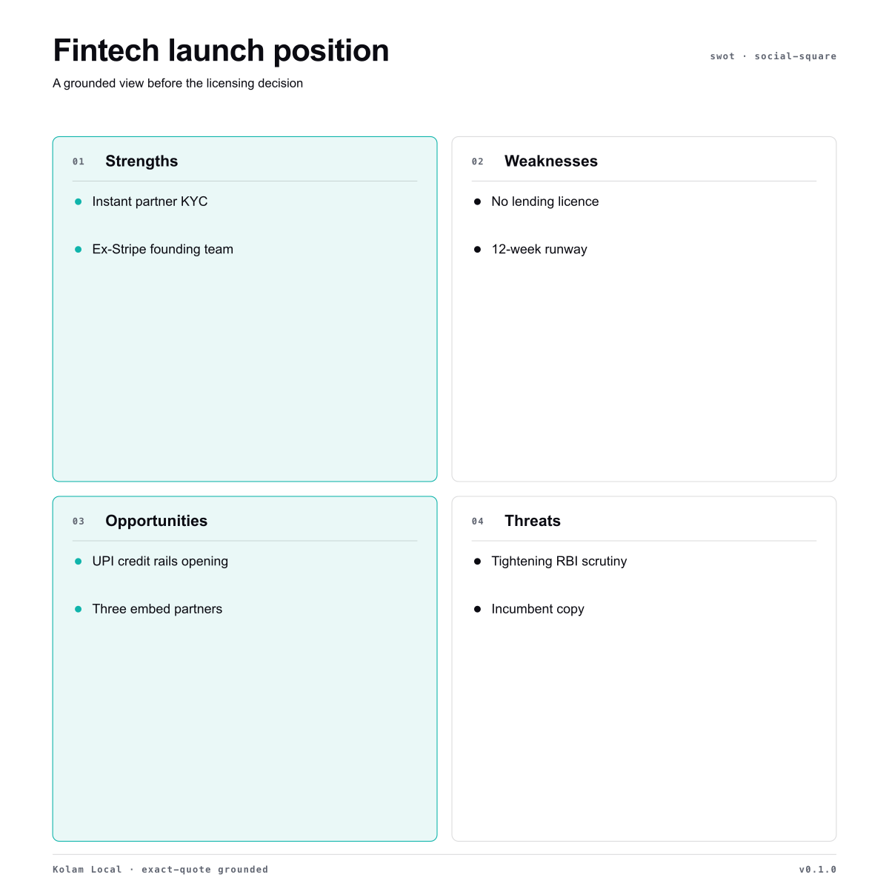
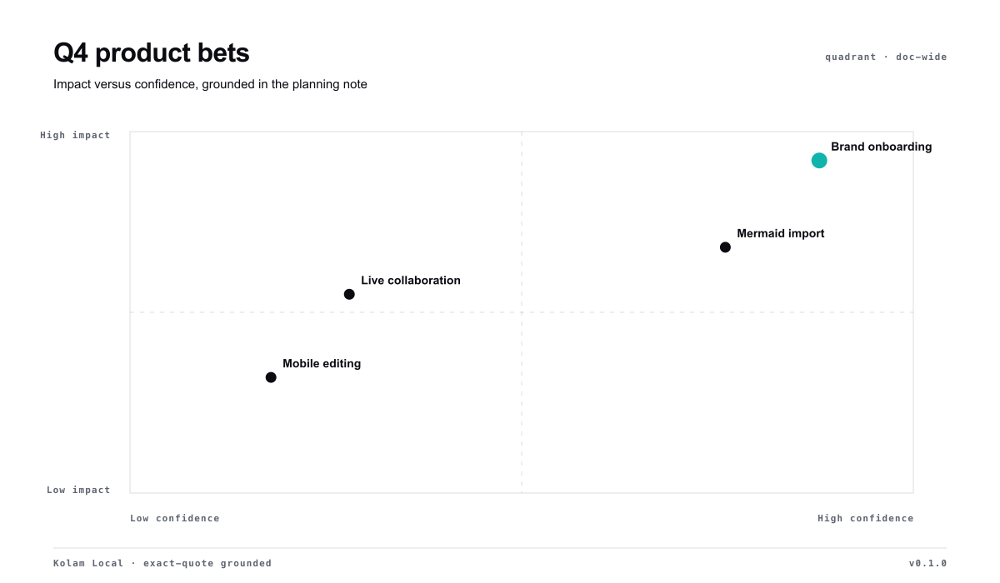
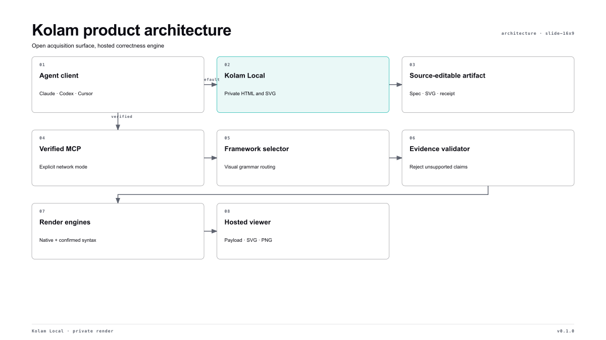

# Diagrams for Agents

**Your agent can draw boxes. Diagrams for Agents chooses the right diagram—and keeps the claims tied to your source.**

Diagrams for Agents turns messy business, product, and technical context into source-editable diagrams. Local Mode is private, account-free, and produces self-contained HTML plus SVG. Verified Mode is an explicit opt-in when you want automatic framework selection, stronger server-side validation, or an API/MCP result.


| Grounded strategy | Decision positioning |
|---|---|
|  |  |



## What makes it different

- **No invented SWOTs.** Business claims carry exact quotes from the supplied source; missing or altered evidence fails the render.
- **Private by default.** Local Mode has no account and makes no network call unless anonymous telemetry is explicitly enabled.
- **Decision first.** Diagrams for Agents selects a visual around what the reader needs to understand, with strict complexity budgets.
- **Artifacts you own.** Every output is a self-contained HTML file with inline SVG, an embedded JSON specification, and an optional receipt.
- **A real escalation path.** Verified Mode connects the same workflow to the product's broader framework catalogue and hosted correctness engine.

## Install

The package uses the shared Agent Skills layout and includes native Codex and Claude plugin manifests.

### Codex

```text
codex plugin marketplace add ankaiinc/diagrams-for-agents
codex plugin add diagrams-for-agents@diagrams-for-agents
```

### Claude Code

```text
/plugin marketplace add ankaiinc/diagrams-for-agents
/plugin install diagrams-for-agents@diagrams-for-agents
```

### Pi

```bash
pi install https://github.com/ankaiinc/diagrams-for-agents
```

### Cursor

```text
/add-plugin https://github.com/ankaiinc/diagrams-for-agents
```

Cursor reads `.cursor-plugin/plugin.json`, loads the shared skill, and configures the Verified MCP from `mcp.json`.

### Other Agent Skills clients

Copy or link `skills/diagrams-for-agents` into the client's skills directory. The skill itself has no package dependencies; the renderer requires Node 18 or newer.

## Try it

Ask your agent:

> Turn these product notes into the one diagram that will help us choose what to build next. Keep it private.

Or render the bundled grounded SWOT directly:

```bash
node skills/diagrams-for-agents/scripts/render.mjs \
  examples/fintech-swot.diagrams-for-agents.json \
  fintech-swot.html \
  --svg fintech-swot.svg \
  --receipt fintech-swot.receipt.json
```

The six Local Mode families are:

| Family | Best for |
|---|---|
| SWOT | Internal/external advantages and risks |
| Quadrant | Positioning on two decision-relevant axes |
| Comparison | Tradeoffs between alternatives |
| Flow | Work and decision logic |
| Timeline | Milestones and change over time |
| Architecture | Components, boundaries, and dependencies |

Browse the generated files in [`examples/`](examples/). Each example is built from a reviewable `.diagrams-for-agents.json` source.

## Mermaid redraw

```bash
node skills/diagrams-for-agents/scripts/import-mermaid.mjs architecture.mmd architecture.diagrams-for-agents.json
node skills/diagrams-for-agents/scripts/render.mjs architecture.diagrams-for-agents.json architecture.html --svg architecture.svg
```

The importer deliberately supports a bounded flowchart grammar. Unsupported Mermaid features fail with a named error rather than disappearing from the output.

## Local versus Verified

| | Local Mode | Verified Mode |
|---|---|---|
| Account | None | Optional free key |
| Content location | Your machine | Sent to configured Diagrams for Agents service |
| Families | Six opinionated local families | Broader framework and engine catalogue |
| Selection | Your installed agent follows the skill | the product's hosted selector |
| Grounding | Exact substring validation | Server-side evidence and schema validation |
| Output | HTML, SVG, receipt | `VisualPayload`, hosted viewer, SVG/PNG |

Local exact-quote checks establish provenance; they do not prove that an analysis is strategically correct. Verified Mode is stronger, but it should never be invoked silently for confidential material.

## Privacy and measurement

Local rendering sends nothing by default. To help measure activation without sending prompts, titles, labels, sources, evidence, filenames, or output content, users may explicitly set:

```bash
DIAGRAMS_FOR_AGENTS_TELEMETRY=1 node skills/diagrams-for-agents/scripts/render.mjs input.diagrams-for-agents.json output.html
```

The event contains only a random installation ID, renderer version, family, destination preset, and number of evidence claims checked. It never includes prompts, titles, labels, sources, evidence, filenames, or output content. The ID is created only after opt-in and stored at `~/.config/diagrams-for-agents/telemetry-id` (override with `DIAGRAMS_FOR_AGENTS_CONFIG_DIR`). Telemetry failure never blocks rendering.

Do not share a generated HTML file blindly: its embedded specification includes the source text used to validate evidence. Use only non-confidential inputs for public examples.

## Development

```bash
npm run verify
```

This rebuilds all examples, runs renderer/importer/adversarial tests, validates every artifact, and checks package manifests for drift.

MIT © Pragmatic Leaders Labs
